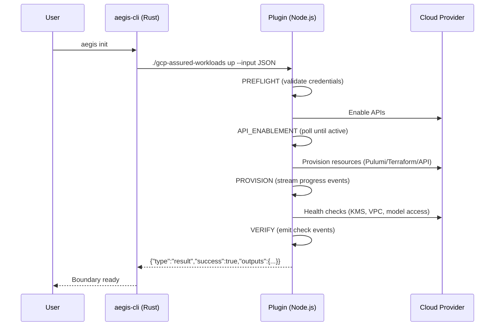
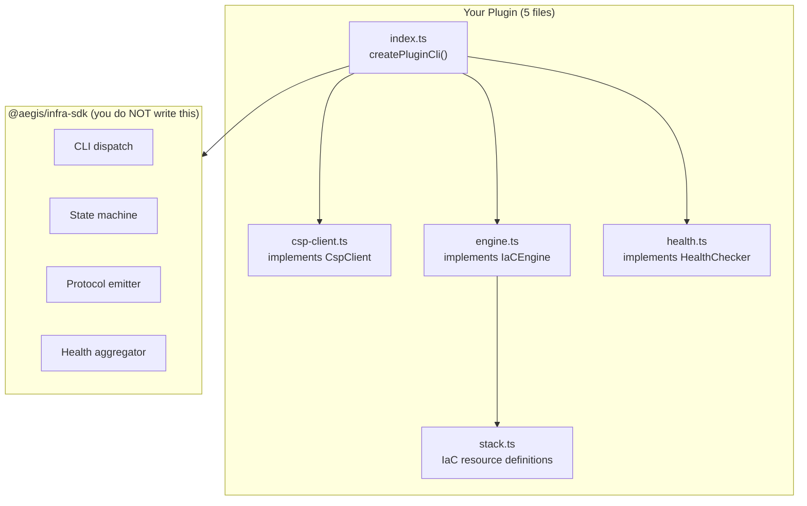
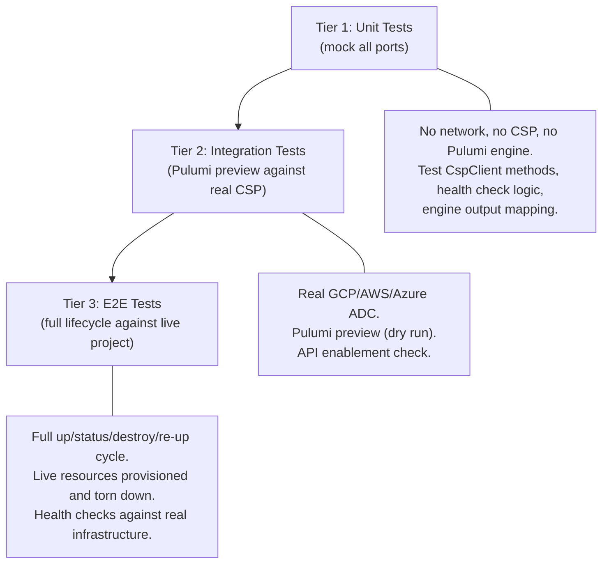

# Plugin Authoring Guide

This guide is the authoritative reference for building an aegis-cli infrastructure backend plugin using `@aegis/infra-sdk`.

## 1. Overview

An aegis-cli plugin is a standalone executable that provisions and manages a compliance boundary in a cloud service provider (CSP). aegis-cli invokes the plugin as a subprocess, communicating via the aegis-infra/v1 JSON-line protocol over stdout. The user never interacts with the plugin directly -- they use `aegis init`, `aegis doctor`, and `aegis destroy`.



The SDK handles protocol compliance, lifecycle orchestration, CLI dispatch, and safety gates. The plugin author implements three port interfaces and writes a declarative entrypoint.

## 2. Naming Convention

Plugins are named `<csp>-<compliance-regime>`:

| Plugin Name | CSP | Compliance Regime |
|-------------|-----|-------------------|
| `gcp-assured-workloads` | Google Cloud | Assured Workloads (IL4/IL5) |
| `aws-govcloud` | AWS | GovCloud (IL4/IL5) |
| `azure-government` | Azure | Azure Government (IL4/IL5) |
| `local-airgap` | None (on-prem) | Air-gapped environments |

**Do not include model names in plugin names.** The model (Gemini, Claude, GPT-4) is a runtime input parameter, not a packaging axis. The boundary is the same regardless of which model the user calls.

Anti-patterns:
- `gcp-cui-gemini` -- bakes in a model
- `aws-bedrock-claude` -- bakes in a model
- `gcp-il4-gemini-pro` -- bakes in model AND impact level

## 3. Quick Start

```bash
mkdir gcp-assured-workloads && cd gcp-assured-workloads
npm init -y
npm install @aegis/infra-sdk
npm install --save-dev typescript @types/node vitest
```

Create `src/index.ts`:

```typescript
import { createPluginCli } from "@aegis/infra-sdk";
import { GcpClient } from "./csp-client.js";
import { PulumiEngine } from "./engine.js";
import { GcpHealthChecker } from "./health.js";

createPluginCli({
  name: "gcp-assured-workloads",
  version: "0.1.0",
  description: "IL4/IL5 Assured Workloads boundary in Google Cloud",
  credentials: ["gcp-adc"],
  inputs: [
    { name: "project_id", type: "string", required: true },
    { name: "region", type: "string", default: "us-central1" },
    { name: "impact_level", type: "enum", values: ["IL4", "IL5"], default: "IL4" },
    { name: "model", type: "string", default: "gemini-2.5-pro-001" },
  ],
  outputs: ["vertex_endpoint", "kms_key_resource_name", "vpc_name", "audit_bucket"],
  cspClient: new GcpClient(),
  engine: new PulumiEngine(),
  healthChecker: new GcpHealthChecker(),
  requiredApis: [
    "compute.googleapis.com",
    "cloudkms.googleapis.com",
    "storage.googleapis.com",
    "iam.googleapis.com",
    "cloudresourcemanager.googleapis.com",
  ],
});
```

Build and test:

```bash
npx tsc
node dist/index.js manifest
```

That is the entire entrypoint. Everything else is in the three implementation files.

## 4. Project Structure



| File | Purpose | Port Interface |
|------|---------|---------------|
| `index.ts` | Declarative entrypoint. Single `createPluginCli()` call. | None (configuration only) |
| `csp-client.ts` | Credential validation, API readiness, API enablement. | `CspClient` |
| `engine.ts` | IaC provisioning (Pulumi, Terraform, CDK, or raw API calls). | `IaCEngine` |
| `health.ts` | Boundary health checks against live APIs. | `HealthChecker` |
| `stack.ts` | IaC resource definitions (e.g., Pulumi program). Referenced by engine.ts. | None (internal to engine) |

If you are writing protocol events, CLI parsing, or state machine logic, stop. That code belongs in the SDK.

## 5. Input Design

Every plugin declares two categories of inputs in its `PluginConfig.inputs` array:

### CSP-specific inputs

These vary per cloud provider:

| GCP | AWS | Azure |
|-----|-----|-------|
| `project_id` (required) | `account_id` (required) | `subscription_id` (required) |
| `access_policy_id` (optional) | `ou_id` (optional) | `management_group` (optional) |

### Universal inputs

Every plugin should include these for consistency:

| Input | Type | Default | Purpose |
|-------|------|---------|---------|
| `region` | string | CSP-specific | Deployment region |
| `impact_level` | enum: IL4, IL5 | IL4 | Compliance impact level |
| `model` | string | CSP-specific | GenAI model identifier |

The SDK validates required inputs and applies defaults from the manifest. The plugin reads values from `config.params["project_id"]` etc.

### Model as a runtime parameter

The model input is validated during VERIFY, not PROVISION. This means:
- The boundary can be provisioned before the user chooses a model
- Switching models does not require re-provisioning
- Model availability issues surface as health check failures

## 6. Implementing CspClient

`CspClient` has four methods. Each should make exactly one API call.

```typescript
import type { CspClient, InfraConfig } from "@aegis/infra-sdk";

export class GcpClient implements CspClient {
  async validateCredentials(): Promise<boolean> {
    // Attempt to fetch an ADC token. Return true if successful.
    try {
      const { GoogleAuth } = await import("google-auth-library");
      const auth = new GoogleAuth({ scopes: ["https://www.googleapis.com/auth/cloud-platform"] });
      const client = await auth.getClient();
      await client.getAccessToken();
      return true;
    } catch {
      return false;
    }
  }

  async checkAccess(config: InfraConfig): Promise<boolean> {
    // Verify the caller can access the project.
    const projectId = config.params["project_id"];
    const resp = await fetch(
      `https://cloudresourcemanager.googleapis.com/v1/projects/${projectId}`,
      { headers: { Authorization: `Bearer ${await this.getToken()}` } },
    );
    return resp.ok;
  }

  async getApiState(config: InfraConfig, api: string): Promise<"ENABLED" | "DISABLED"> {
    // Check if a single API is enabled.
    const projectId = config.params["project_id"];
    const resp = await fetch(
      `https://serviceusage.googleapis.com/v1/projects/${projectId}/services/${api}`,
      { headers: { Authorization: `Bearer ${await this.getToken()}` } },
    );
    if (!resp.ok) return "DISABLED";
    const data = await resp.json() as { state?: string };
    return data.state === "ENABLED" ? "ENABLED" : "DISABLED";
  }

  async enableApi(config: InfraConfig, api: string): Promise<void> {
    // Enable a single API.
    const projectId = config.params["project_id"];
    await fetch(
      `https://serviceusage.googleapis.com/v1/projects/${projectId}/services/${api}:enable`,
      {
        method: "POST",
        headers: { Authorization: `Bearer ${await this.getToken()}` },
      },
    );
  }

  private async getToken(): Promise<string> {
    const { GoogleAuth } = await import("google-auth-library");
    const auth = new GoogleAuth({ scopes: ["https://www.googleapis.com/auth/cloud-platform"] });
    const client = await auth.getClient();
    const token = await client.getAccessToken();
    return token.token!;
  }
}
```

For **AWS GovCloud**, the same pattern uses STS for credential validation, Organizations for account access, and Service Quotas or direct API calls for service readiness.

## 7. Implementing IaCEngine

`IaCEngine` has four methods: `preview`, `up`, `destroy`, `getOutputs`.

The recommended approach is Pulumi Automation API with a local file backend:

```typescript
import type { IaCEngine, InfraConfig, BoundaryOutput } from "@aegis/infra-sdk";
import { resolveStateDir, ensureStateDir, buildStackName } from "@aegis/infra-sdk";
import * as automation from "@pulumi/pulumi/automation/index.js";
import { defineResources, extractOutputs } from "./stack.js";

export class PulumiEngine implements IaCEngine {
  async preview(config: InfraConfig): Promise<void> {
    const stack = await this.getStack(config);
    await stack.preview();
  }

  async up(config: InfraConfig): Promise<BoundaryOutput> {
    const stack = await this.getStack(config);
    const result = await stack.up();
    return extractOutputs(result.outputs);
  }

  async destroy(config: InfraConfig): Promise<void> {
    const stack = await this.getStack(config);
    await stack.destroy();
  }

  async getOutputs(config: InfraConfig): Promise<BoundaryOutput | undefined> {
    try {
      const stack = await this.getStack(config);
      const outputs = await stack.outputs();
      return Object.keys(outputs).length > 0
        ? extractOutputs(outputs)
        : undefined;
    } catch {
      return undefined;
    }
  }

  private async getStack(config: InfraConfig): Promise<automation.Stack> {
    ensureStateDir("gcp-assured-workloads");
    return automation.LocalWorkspace.createOrSelectStack({
      stackName: buildStackName(config.params, "gcp-assured-workloads"),
      projectName: "gcp-assured-workloads",
      program: defineResources(config),
    }, {
      projectSettings: {
        name: "gcp-assured-workloads",
        runtime: "nodejs",
        backend: { url: `file://${resolveStateDir("gcp-assured-workloads")}` },
      },
      envVars: { PULUMI_CONFIG_PASSPHRASE: "" },
    });
  }
}
```

Key rules:
- State backend is local (`file://~/.aegis/state/<plugin-name>/`)
- Stack name is deterministic from input parameters
- `up` is idempotent (Pulumi convergence)
- `destroy` on an empty stack is a no-op
- `getOutputs` reads state without running an update

## 8. Implementing HealthChecker

`HealthChecker` has one method: `checkAll(config, outputs?)`.

Every check must return one of three statuses:

| Status | Meaning | When to use |
|--------|---------|-------------|
| `pass` | Verified working | API confirmed the resource exists and is correctly configured |
| `fail` | Verified broken | API confirmed the resource is missing, disabled, or misconfigured. Include actionable detail. |
| `warn` | Cannot determine | Insufficient permissions or network error. Never mask a real failure as warn. |

```typescript
import type { HealthChecker, InfraConfig, BoundaryOutput, HealthCheck } from "@aegis/infra-sdk";

export class GcpHealthChecker implements HealthChecker {
  async checkAll(config: InfraConfig, outputs?: BoundaryOutput): Promise<HealthCheck[]> {
    const results = await Promise.allSettled([
      this.checkKmsKey(config, outputs),
      this.checkVpcSc(config, outputs),
      this.checkAuditBucket(config, outputs),
      this.checkModelAccess(config, outputs),
    ]);

    return results.map((r) =>
      r.status === "fulfilled"
        ? r.value
        : { name: "unknown", status: "warn" as const, detail: String(r.reason) },
    );
  }

  private async checkModelAccess(
    config: InfraConfig,
    outputs?: BoundaryOutput,
  ): Promise<HealthCheck> {
    const model = config.params["model"] ?? "gemini-2.5-pro-001";
    const endpoint = outputs?.["vertex_endpoint"]
      ?? `${config.params["region"]}-aiplatform.googleapis.com`;

    // Use authenticated request -- never treat 401/403 as pass
    const token = await this.getToken();
    const resp = await fetch(
      `https://${endpoint}/v1/projects/${config.params["project_id"]}/locations/${config.params["region"]}/publishers/google/models/${model}`,
      { headers: { Authorization: `Bearer ${token}` } },
    );

    if (resp.ok) {
      return { name: "model_accessible", status: "pass", detail: `${model} accessible via ${endpoint}` };
    }
    if (resp.status === 403) {
      return { name: "model_accessible", status: "fail", detail: `Caller lacks aiplatform.user role (HTTP 403)` };
    }
    return { name: "model_accessible", status: "fail", detail: `${model} returned HTTP ${resp.status}` };
  }
}
```

Critical rules:
- **Always use the `outputs` parameter** to resolve actual resource names. Pulumi adds random suffixes; hardcoded names will fail.
- **Never treat HTTP 401/403 as pass.** These are authentication/authorization failures. The boundary is not working if the user cannot access it.
- **Use `Promise.allSettled`**, not `Promise.all`. One failing check must not prevent other checks from running.
- **Include actionable detail in fail messages.** "KMS key disabled" is not actionable. "KMS key aegis-cmek-key-c4a8c14 is DISABLED. Re-enable via Cloud Console or run 'up' to re-provision." is actionable.

## 9. The 10 Best Practices

### 1. Three files, three concerns
A plugin has `csp-client.ts`, `engine.ts`, `health.ts`. If you need a fourth file, it should be the IaC resource definition (`stack.ts`) referenced by your engine. Never split concerns differently.

### 2. The entrypoint is declarative
`index.ts` is a single `createPluginCli()` call with a config object. No imperative logic.

### 3. Health checks must fail honest
Pass means verified working. Fail means verified broken with actionable detail. Warn means cannot determine. Never lie about boundary health.

### 4. Outputs are routing metadata, never secrets
Endpoint URLs, resource names, configuration flags. Never API keys, tokens, or credentials.

### 5. Every resource gets compliance labels/tags
Tag all resources: `aegis-managed: true`, impact level, compliance framework. This is how auditors find boundary resources.

### 6. CSP client methods are individually testable
One API call per method. Mock at the method level in Tier 1 tests. No HTTP mocking needed.

### 7. Health checks accept outputs
Every check takes `(config, outputs?)`. Use actual resource names from Pulumi state.

### 8. Engine operations are idempotent
`up` twice = same result. `destroy` on empty = no-op. `preview` never mutates state.

### 9. Required APIs are declared, not discovered
List them in `PluginConfig.requiredApis`. The SDK handles enablement.

### 10. Plugin-specific warnings go in health checks
VERIFY is the single source of truth. PROVISION emits only progress events. Do not emit diagnostic warnings during provisioning -- surface issues during VERIFY where they can be aggregated and acted on.

## 10. Testing Your Plugin



### Tier 1: Unit tests (mock ports)

Mock `CspClient` methods to test health check logic, engine output extraction, and CSP client error handling. These run in CI with no credentials.

```typescript
import { vi } from "vitest";

const mockClient: CspClient = {
  validateCredentials: vi.fn().mockResolvedValue(true),
  checkAccess: vi.fn().mockResolvedValue(true),
  getApiState: vi.fn().mockResolvedValue("ENABLED"),
  enableApi: vi.fn().mockResolvedValue(undefined),
};
```

### Tier 2: Integration tests (Pulumi preview)

Run `preview` against a real CSP project with ADC credentials. No resources are created. Validates that the Pulumi stack compiles and the CSP API calls work.

### Tier 3: E2E tests (live lifecycle)

Run the full `up` -> `status` -> `destroy` -> `re-up` cycle against a dedicated test project. These run manually or in a protected CI environment with live credentials.

## 11. Packaging for Distribution

### Development (requires Node.js >= 22)

```bash
npm run build
node dist/index.js manifest
```

### Production (bundled single binary)

```bash
# Using bun
bun build src/index.ts --compile --outfile gcp-assured-workloads

# Using pkg
npx pkg dist/index.js --targets node22-linux-x64,node22-macos-arm64,node22-win-x64
```

The binary must respond to `manifest` with no network access. The manifest is a static JSON object.

Place the binary in `~/.aegis/plugins/` for aegis-cli to discover it.

## 12. Release Process

1. **Version bump**: update `version` in `package.json` and `PluginConfig`
2. **Changelog**: document changes in CHANGELOG.md
3. **Test**: run full Tier 1 + Tier 2 suite; run Tier 3 manually against test project
4. **Build**: produce platform binaries for darwin-arm64, linux-x64, linux-arm64, windows-x64
5. **Checksums**: generate SHA256 for each binary
6. **SBOM**: generate CycloneDX SBOM for supply chain accountability
7. **Tag**: `git tag v<version>`
8. **Release**: upload binaries, checksums, and SBOM to GitHub Releases
9. **Publish**: `npm publish` for development distribution

The SDK contract version (`aegis-infra/v1`) is independent of your plugin version. aegis-cli checks the contract version at discovery time and rejects incompatible plugins.
