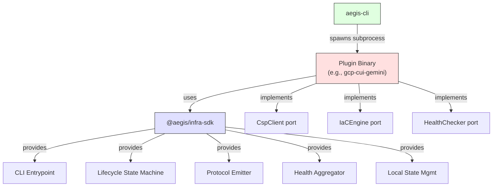

# @aegis/infra-sdk

[](https://github.com/rtmx-ai/aegis-infra-sdk/actions/workflows/ci.yml)
[](LICENSE)
[](.nvmrc)
[](PLUGIN_GUIDE.md)

Plugin SDK for aegis-cli infrastructure backends. This package extracts the generic plugin infrastructure (CLI argument parsing, lifecycle state machine, JSON-line protocol emission, health check aggregation, and local state management) from concrete IaC deployer plugins so that each new cloud-provider plugin implements only its domain-specific logic: resource definitions, health checks, and API client calls.

## Architecture



The SDK sits between aegis-cli and the plugin implementation. aegis-cli spawns the plugin binary as a subprocess and communicates over a JSON-line stdout protocol (aegis-infra/v1). The plugin author only implements three port interfaces -- the SDK handles all CLI parsing, protocol emission, lifecycle orchestration, and error handling.

## Quick Start

```typescript
#!/usr/bin/env node
import { createPluginCli } from "@aegis/infra-sdk";
import type { CspClient, IaCEngine, HealthChecker } from "@aegis/infra-sdk";

// Implement the three port interfaces for your cloud provider
const myCspClient: CspClient = { /* ... */ };
const myEngine: IaCEngine = { /* ... */ };
const myHealthChecker: HealthChecker = { /* ... */ };

createPluginCli({
  name: "my-cloud-plugin",
  version: "0.1.0",
  description: "Provisions resources on MyCloud",
  credentials: ["mycloud-token"],
  inputs: [
    { name: "project_id", type: "string", required: true },
    { name: "region", type: "string", default: "us-east-1" },
  ],
  outputs: ["endpoint_url", "resource_id"],
  cspClient: myCspClient,
  engine: myEngine,
  healthChecker: myHealthChecker,
  requiredApis: ["compute.mycloud.com", "storage.mycloud.com"],
});
```

That is the entire plugin entrypoint. The SDK handles:
- Parsing `process.argv` for subcommand and `--input` JSON
- Validating required inputs against the declared schema
- Running preflight checks via your `CspClient`
- Enabling required APIs and polling until active
- Dispatching to your `IaCEngine` for preview/up/destroy
- Running health checks and aggregating results
- Emitting all protocol events as newline-delimited JSON on stdout
- Catching errors and emitting structured error results

## API Reference

### `createPluginCli(config: PluginConfig): Promise<void>`

The single public API. Call this from your plugin's entrypoint. It reads `process.argv`, dispatches the subcommand, and handles all protocol emission.

### `PluginConfig`

```typescript
interface PluginConfig {
  name: string;              // Plugin name (used in manifest and state dir)
  version: string;           // Semver version string
  description: string;       // Human-readable description
  credentials: string[];     // Required credential types (e.g., ["gcp-adc"])
  inputs: InputField[];      // Declared input schema
  outputs: string[];         // Declared output field names
  cspClient: CspClient;      // Cloud provider API client implementation
  engine: IaCEngine;         // IaC engine implementation
  healthChecker: HealthChecker; // Health check implementation
  requiredApis: string[];    // APIs to enable before provisioning
  stateDir?: string;         // Custom state directory (default: ~/.aegis/state/{name}/)
  apiPollIntervalMs?: number; // API poll interval (default: 5000)
  apiPollTimeoutMs?: number;  // API poll timeout (default: 120000)
}
```

### `CspClient` (port interface)

```typescript
interface CspClient {
  validateCredentials(): Promise<boolean>;
  checkAccess(config: InfraConfig): Promise<boolean>;
  getApiState(config: InfraConfig, api: string): Promise<"ENABLED" | "DISABLED">;
  enableApi(config: InfraConfig, api: string): Promise<void>;
}
```

### `IaCEngine` (port interface)

```typescript
interface IaCEngine {
  preview(config: InfraConfig): Promise<void>;
  up(config: InfraConfig): Promise<BoundaryOutput>;
  destroy(config: InfraConfig): Promise<void>;
  getOutputs(config: InfraConfig): Promise<BoundaryOutput | undefined>;
}
```

### `HealthChecker` (port interface)

```typescript
interface HealthChecker {
  checkAll(config: InfraConfig, outputs?: BoundaryOutput): Promise<HealthCheck[]>;
}
```

### `InfraConfig`

```typescript
interface InfraConfig {
  readonly params: Record<string, string>;  // Parsed --input JSON
}
```

### `BoundaryOutput`

```typescript
type BoundaryOutput = Record<string, string>;  // Plugin-defined output keys
```

## Development Commands

```bash
# Install dependencies
nvm use && npm install

# Build
npm run build

# Lint and format
npm run lint
npm run lint:fix
npm run format
npm run format:fix

# Test
npm test                   # all tests
npm run test:unit          # unit tests only

# Run a single test file
npx vitest run src/cli/__tests__/args.test.ts

# Run tests matching a pattern
npx vitest run -t "parseSubcommand"
```

## Project Structure

```
src/
  cli/
    entrypoint.ts     - createPluginCli() (the single public API)
    args.ts           - parseSubcommand, parseInput, extractInput, requireConfirmDestroy
  lifecycle/
    state-machine.ts  - runPreflight, enableApis, checkApiReadiness, pollApiEnabled
    types.ts          - InitState enum, InitContext interface
  protocol/
    emitter.ts        - StdoutEmitter class
    events.ts         - ProtocolEvent union type
    manifest.ts       - buildManifest() from PluginConfig
  domain/
    types.ts          - InfraConfig, BoundaryOutput, HealthCheck, InputField, etc.
    ports.ts          - CspClient, IaCEngine, HealthChecker interfaces
  health/
    aggregator.ts     - aggregateChecks()
  state/
    local.ts          - resolveStateDir(), ensureStateDir(), buildStackName()
  index.ts            - re-export public API
```
