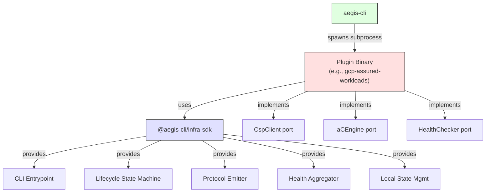

# Aegis Plugin SDK

`@aegis-cli/infra-sdk` is the plugin SDK for [aegis-cli](https://github.com/rtmx-ai/aegis-cli). It extracts the generic plugin infrastructure -- CLI argument parsing, lifecycle state machine, JSON-line protocol emission, health check aggregation, and local state management -- so that each new cloud-provider plugin implements only its domain-specific logic.

## Who is this for?

This SDK is for **plugin developers** who want to build an infrastructure backend for aegis-cli. If you are an end user of aegis-cli, you do not need this package. You install plugins; you do not write them (unless you want to support a new cloud provider or compliance regime).

## The Three-Port Model

Every aegis-cli plugin implements exactly three port interfaces. The SDK handles everything else.

| Port | Purpose | Example |
|------|---------|---------|
| `CspClient` | Cloud provider API client for credential validation, access checks, and API enablement | GCP ADC token fetch, project access, service enablement |
| `IaCEngine` | Infrastructure-as-Code provisioning (preview, up, destroy, getOutputs) | Pulumi Automation API with local file backend |
| `HealthChecker` | Boundary health verification against live infrastructure | KMS key status, VPC-SC perimeter, model accessibility |

The plugin author writes these three implementations plus a declarative entrypoint (`createPluginCli()`). The SDK provides CLI dispatch, the 4-phase lifecycle state machine, protocol emission, health aggregation, output validation, and security enforcement.

## Architecture

The SDK sits between aegis-cli and the plugin implementation. aegis-cli spawns the plugin binary as a subprocess and communicates over a JSON-line stdout protocol (`aegis-infra/v1`). The plugin author only implements three port interfaces -- the SDK handles all CLI parsing, protocol emission, lifecycle orchestration, and error handling.

## 4-Phase Lifecycle

Every plugin subcommand (except `manifest`) runs through a state machine with four phases:

1. **PREFLIGHT** -- Validate credentials and project access via `CspClient`
2. **API_ENABLEMENT** -- Enable required cloud APIs and poll until active
3. **PROVISION** -- Dispatch to `IaCEngine` for preview/up/destroy
4. **VERIFY** -- Run `HealthChecker.checkAll()` and aggregate results

The SDK manages phase transitions, emits diagnostic events at each boundary, and catches errors with structured error results.

## Next Steps

- [Getting Started](./getting-started.mdx) -- Install the SDK and create your first plugin
- [API Reference](./api-reference.mdx) -- All public exports with TypeScript signatures
- [Plugin Authoring Guide](./plugin-guide.mdx) -- Complete reference for building plugins
- [Security Model](./security.mdx) -- Threat model and mitigations
